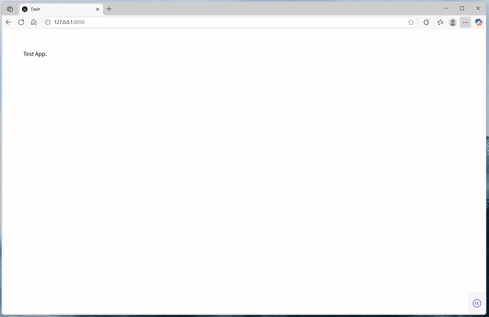

# dash-disable-devtool-plugin

[](https://github.com/CNFeffery/dash-disable-devtool-plugin/blob/main/LICENSE)
[](https://pypi.org/project/dash-disable-devtool-plugin/)
[](https://github.com/astral-sh/ruff)

简体中文 | [English](./README.md)

适用于[Dash](https://github.com/plotly/dash)应用的浏览器开发者工具禁用插件，基于`Dash Hooks`实现，用于为当前应用配置浏览器开发者工具相关功能的禁用权限。

## 安装

```bash
pip install dash-disable-devtool-plugin
```

## 使用

```python
from dash import Dash

# 导入插件启用函数
from dash_disable_devtool_plugin import setup_disable_devtool_plugin

# 为当前应用启用插件
setup_disable_devtool_plugin()

app = Dash(__name__)

# 其他应用代码...
```

## 示例

在基础示例应用中，禁用了浏览器中启用开发者工具的各种快捷键方式，且即使使用其他特殊方式启用了开发者工具，也会很快被应用检测到，从而自动触发页面清空、内容重写等操作：

```bash
python example.py
```

<center></center>

## 参数说明

### `setup_disable_devtool_plugin()`

This function sets up the disable-devtool plugin for your Dash application, preventing users from accessing browser developer tools.

| 参数             | 类型   | 默认值                                                                  | 描述                                                                                                                                                                                                        |
| ---------------- | ------ | ----------------------------------------------------------------------- | ----------------------------------------------------------------------------------------------------------------------------------------------------------------------------------------------------------- |
| `script_src`     | `str`  | `"https://cdn.jsdelivr.net/npm/disable-devtool"`                        | 依赖的 disable-devtool 静态资源地址，常见的可用资源地址有：`https://unpkg.com/disable-devtool/disable-devtool.min.js`, `https://registry.npmmirror.com/disable-devtool/latest/files/disable-devtool.min.js` |
| `disable_menu`   | `bool` | `False`                                                                 | 是否禁用页面内右键菜单功能                                                                                                                                                                                  |
| `disable_select` | `bool` | `False`                                                                 | 是否禁用页面内选择功能                                                                                                                                                                                      |
| `disable_copy`   | `bool` | `False`                                                                 | 是否禁用页面内复制功能                                                                                                                                                                                      |
| `disable_cut`    | `bool` | `False`                                                                 | 是否禁用页面内剪切功能                                                                                                                                                                                      |
| `disable_paste`  | `bool` | `False`                                                                 | 是否禁用页面内粘贴功能                                                                                                                                                                                      |
| `rewrite_html`   | `str`  | `"The current application disables debugging through developer tools."` | 当检测到开发者工具后，对页面进行重写对应的 HTML 内容                                                                                                                                                        |
